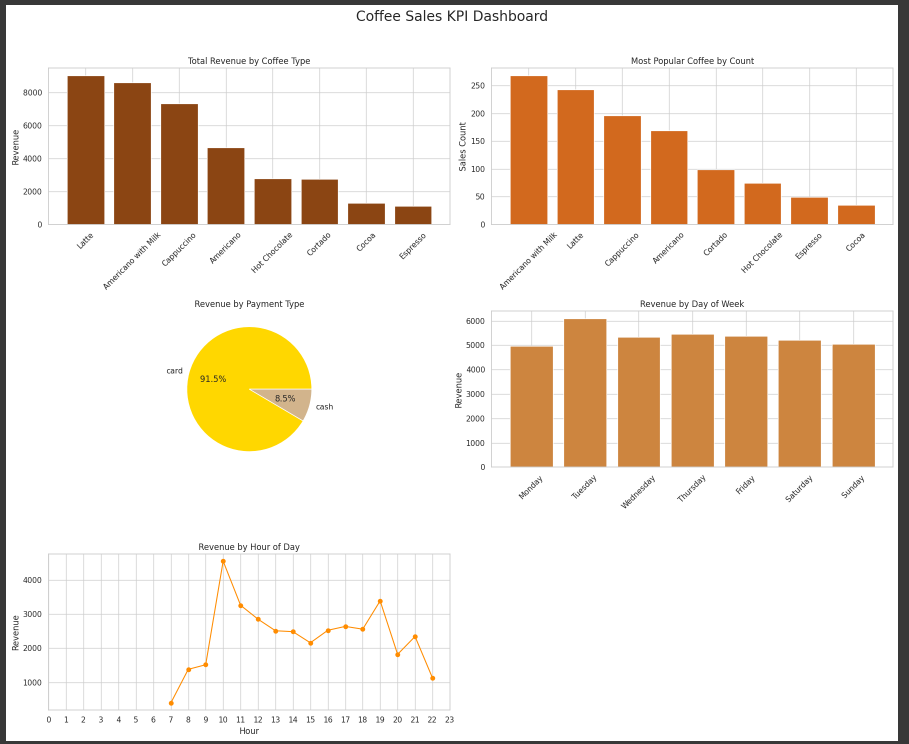

# Coffee Sales Project


---
### This project contains analysis of a coffee shop and provide a machine learning model which can predict price of coffee based on learned feature.
### This project is one of the project from the Data Analyst internship provided by Unified Mentor.
--- 
## 📋 Table of Sections

1. [Data Analysis](#data-analysis)
2. [Library](#library)
3. [Dataset](#dataset)
4. [Machine Learning Model](#machine-learning-model)
5. [Visualization Output - 5-in-1 Plot](#visualization-output---5-in-1-plot)
6. [Clone a Repo](#clone-a-repo)

---

### 📊 Data Analysis

In this project, various types of data analysis were performed using Python, including univariate, bivariate, and multivariate analysis:
* Univariate Analysis: Focused on individual variables using visualizations such as histograms, line plots, box plots, and pie charts.
* Bivariate Analysis: Explored relationships between two variables using scatter plots and bar plots.
* Multivariate Analysis: Analyzed interactions among multiple variables using heatmaps and pair plots.

---

### 📚 Library

```bash
pip install numpy
pip install pandas
pip install scikit-learn
pip install matplotlib
pip install seaborn
```

---

### 📁 Dataset

**Dataset Link:** [Click here to view the dataset](https://drive.google.com/file/d/1YqP5Na7_o2xBwsFcf-0NTK31u5_EpxKC/view)

**Dataset Description:**

This dataset captures transaction data from a coffee shop. It includes details such as:

- Date and time of each transaction  
- Payment method (specifically card-based payments) & Encrypted (Dummy) Card details
- Transaction amount  
- Type of coffee sold  

Each row represents a unique transaction, with customers identified by a unique card number. The dataset enables exploration of:

- Customer preferences  
- Sales trends over time  
- Popularity of various coffee types (e.g., Latte, Hot Chocolate, Americano, etc.)

---

### 🤖 Machine Learning Model

A **Linear Regression** model was used to predict the transaction amount (`money`) based on the following features:

- `coffee_name`: Type of coffee sold  
- `cash_type`: Mode of payment  
- `hour`: Hour of the transaction  
- `day_of_week`: Day on which the transaction occurred

**Model Performance:**

- **Root Mean Squared Error (RMSE):** 1.84  
- **R² Score:** 0.82  

These results indicate that the model explains approximately 82% of the variance in transaction amounts, suggesting a good fit for the data.

---

### 🖼️ Visualization Output - 5-in-1 Plot

A dashboard-style visualization was created to provide a comprehensive overview of the coffee shop's sales data. It includes the following five plots:

1. **Total Revenue by Coffee Type** (Bar Plot)  
2. **Most Popular Coffee by Count** (Bar Plot)  
3. **Revenue by Payment Type** (Pie Chart)  
4. **Revenue by Day of the Week** (Bar Plot)  
5. **Revenue by Hour of the Day** (Line Plot)

These plots were combined into a single figure for better visual insight.



---

### 🧬 Clone a Repo

```bash
git clone https://github.com/UmerSalimKhan/Coffee-Sales-Analysis-Machine-Learning.git
cd "Coffee-Sales-Analysis-Machine-Learning"
```

Once this is achieved, install the libraries mentioned above.
